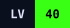
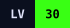
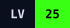
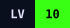
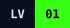

<div align="center">

<a href="https://ledevmoraes.vercel.app/">
  
</a>

**Engenheiro de Software Full Stack** · React · React Native · TypeScript · Node.js · NestJS · PostgreSQL

<a href="https://ledevmoraes.vercel.app/"></a>
<a href="https://www.linkedin.com/in/ledevmoraes/"></a>
<a href="mailto:leonardomoraesdev@gmail.com"></a>

</div>

```bash
leo@ledevmoraes:~$ ledevmoraes --init
> carregando perfil ....... OK
> stack: [react, react-native, node, nestjs, postgres]
> xp: 5 anos · quests: 6 · automações python: 30+ · horas/mês economizadas: ~200
✓ pronto para a próxima missão
```

## 🧙 Character sheet

Sou o Leo, de Guaratinguetá/SP, engenheiro da computação (UNISAL, 2022) e dev full stack há 5 anos. Construo produtos web e mobile de ponta a ponta: levanto as regras de negócio, modelo os dados e faço APIs, interfaces, integrações e a sustentação depois do deploy.

Hoje atuo como **desenvolvedor autônomo** à frente de **CidadeTem** e **Slamly** (neste último, como dev fundador). Entre março e setembro de 2026 também atuei na **Lomiens**. Antes disso, ajudei a evoluir um SaaS de fidelização na **Retorne.app** e automatizei a operação industrial na **Gerdau Summit**.

> ⚑ **Regra da guilda:** toda quest é entregue com documentação, manual de usuário, varreduras de segurança usando OWASP Top 10 e ASVS e testes unitários.

🎯 **Disponível** para vagas full stack (remoto · CLT ou PJ) e projetos freelance de web, mobile e automação.

## ⚔️ Quest log

<table>
  <tr>
    <td width="50%" valign="top">
      
      <h3><a href="https://slamly.com.br/">Slamly</a></h3>
      <p>App de comunidade para esportes de raquete.</p>
    </td>
    <td width="50%" valign="top">
      
      <h3><a href="https://retorne.app/">Retorne.app</a></h3>
      <p>SaaS de CRM, fidelização e campanhas para estabelecimentos de alimentação e beleza.</p>
    </td>
  </tr>
  <tr>
    <td width="50%" valign="top">
      
      <h3>CidadeTem</h3>
      <p>Plataforma de gestão turística para cidades de pequeno porte.</p>
    </td>
    <td width="50%" valign="top">
      
      <h3><a href="https://lomiens.com/">Lomiens</a></h3>
      <p>Sistema de gestão hoteleira.</p>
    </td>
  </tr>
  <tr>
    <td width="50%" valign="top">
      
      <h3>Gerdau Summit</h3>
      <p>Indústria de aços fundidos e forjados do grupo Gerdau.</p>
    </td>
    <td width="50%" valign="top">
      
      <h3><a href="https://jmuaythai.vercel.app/">jmuaythai</a></h3>
      <p>Plataforma web para academia de muay thai.</p>
    </td>
  </tr>
</table>

## 📈 Level up journey

<table>
  <tr>
    <td></td>
    <td><b>Desenvolvedor Autônomo</b><br><sub>CidadeTem · Slamly</sub></td>
    <td><code>2026 — hoje</code></td>
  </tr>
  <tr>
    <td></td>
    <td><b>Desenvolvedor Full Stack</b><br><sub>Lomiens</sub></td>
    <td><code>mar/2026 — set/2026</code></td>
  </tr>
  <tr>
    <td></td>
    <td><b>Desenvolvedor Full Stack</b><br><sub>Retorne.app</sub></td>
    <td><code>mar/2025 — mar/2026</code></td>
  </tr>
  <tr>
    <td></td>
    <td><b>Desenvolvedor de Sistemas</b><br><sub>Gerdau Summit</sub></td>
    <td><code>out/2022 — jan/2025</code></td>
  </tr>
  <tr>
    <td></td>
    <td><b>Estágio: início da jornada</b><br><sub>Gerdau Summit</sub></td>
    <td><code>jul/2021 — set/2022</code></td>
  </tr>
</table>

<div align="center">

## 🛠️ Sistemas e técnicas


<details>
<summary><b>Ver a árvore de skills completa</b></summary>
<br>
<table align="center">
  <tr><td><b>Frontend</b></td><td>React, Next.js, TypeScript, Tailwind CSS, Framer Motion</td></tr>
  <tr><td><b>Mobile</b></td><td>React Native, Expo, push notifications, deep links, geolocalização</td></tr>
  <tr><td><b>Backend</b></td><td>Node.js, NestJS, Express, APIs REST, WebSockets, Prisma, TypeORM</td></tr>
  <tr><td><b>Dados & automação</b></td><td>PostgreSQL, Redis, Python, scraping</td></tr>
  <tr><td><b>DevOps & infra</b></td><td>Docker, GitHub Actions, Linux, Railway, Magalu Cloud, Dokploy</td></tr>
  <tr><td><b>Qualidade & docs</b></td><td>Jest, Vitest, Swagger, Insomnia</td></tr>
</table>
</details>

## 🏆 Achievements

<table align="center">
  <tr>
    <td align="center"><code>&lt;/&gt;</code> <b>Full Stack</b><br><sub>5 anos entre web e mobile</sub></td>
    <td align="center"><code>PY</code> <b>Mestre da automação</b><br><sub>~30 automações em produção</sub></td>
    <td align="center"><code>200H</code> <b>Guardião do tempo</b><br><sub>~200 h/mês devolvidas ao time</sub></td>
  </tr>
  <tr>
    <td align="center"><code>ENG</code> <b>Engenheiro formado</b><br><sub>Eng. da Computação · UNISAL</sub></td>
    <td align="center"><code>x6</code> <b>Ship it</b><br><sub>6 quests em produção</sub></td>
    <td align="center">🔒 <b>Global scale</b><br><sub>em desenvolvimento</sub></td>
  </tr>
</table>

</div>

---

<div align="center">

**Pronto para a próxima missão?** [Inicie o contato →](https://ledevmoraes.vercel.app/#contato)

</div>
