

**Engenheiro de Software Full Stack** · React · React Native · TypeScript · Node.js · NestJS · PostgreSQL


## 🧙 Character sheet

Sou o Leo, de Guaratinguetá/SP, engenheiro da computação (UNISAL, 2022) e dev full stack há 5 anos. Construo produtos web e mobile de ponta a ponta: levanto as regras de negócio, modelo os dados e faço APIs, interfaces, integrações e a sustentação depois do deploy.

Hoje atuo como **desenvolvedor autônomo** e sou **dev fundador** do **CidadeTem** e do **Slamly**. Entre março e setembro de 2026 também atuei na **Lomiens**. Antes disso, ajudei a evoluir um SaaS de fidelização na **Retorne.app** e automatizei a operação industrial na **Gerdau Summit**.

> ⚑ **Regra da guilda:** toda quest é entregue com documentação, manual de usuário, varreduras de segurança usando OWASP Top 10 e ASVS e testes unitários.

🎯 **Disponível** para vagas full stack (remoto · CLT ou PJ) e projetos freelance de web, mobile e automação.

## ⚔️ Quest log

  <a href="https://slamly.com.br/">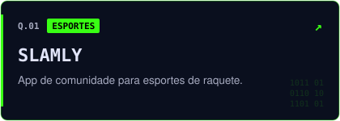</a>
  <a href="https://retorne.app/">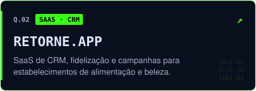</a>
  <a href="https://www.cidadetem.tur.br/">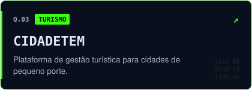</a>
  <a href="https://lomiens.com/">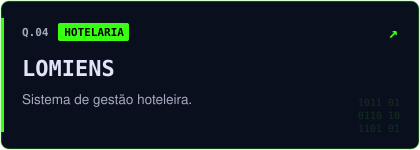</a>
  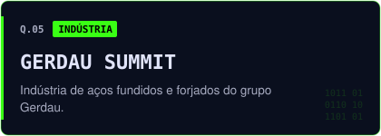
  <a href="https://jmuaythai.vercel.app/">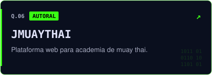</a>

## 📈 Level up journey

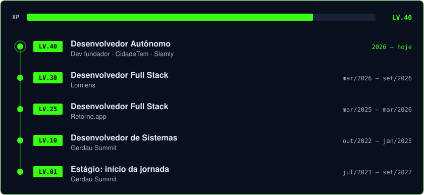

## 🛠️ Sistemas e técnicas

<b>Ver a árvore de skills completa</b>

 

  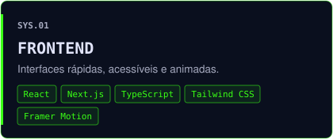
  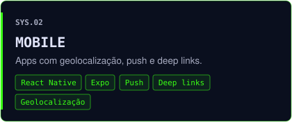
  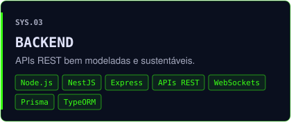
  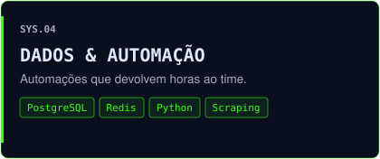
  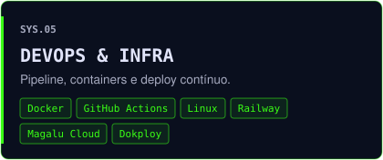
  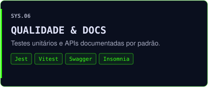

## 🏆 Achievements

  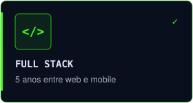
  
  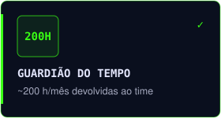
  
  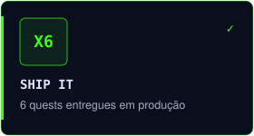
  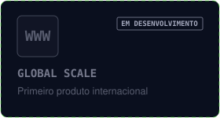

---

**Pronto para a próxima missão?** [Inicie o contato →](https://ledevmoraes.vercel.app/#contato)

